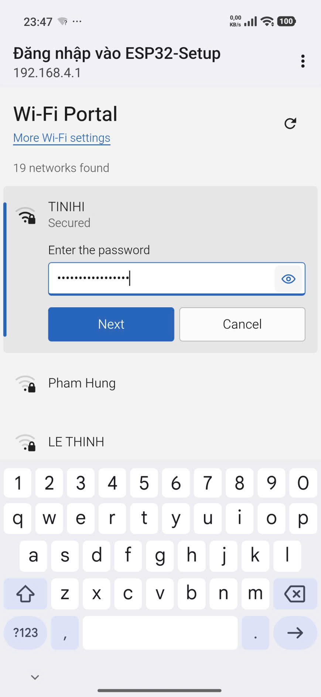
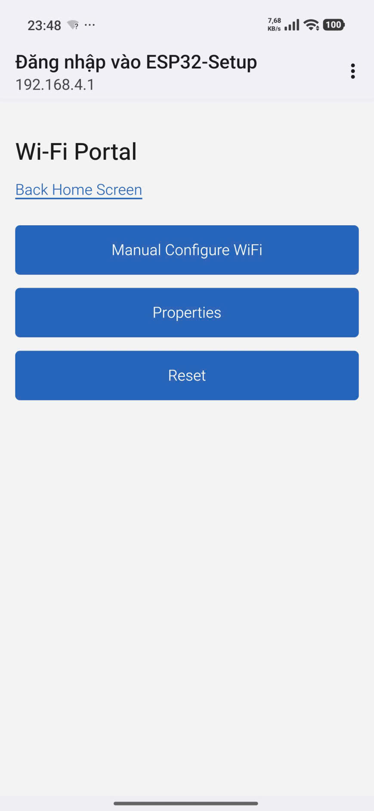
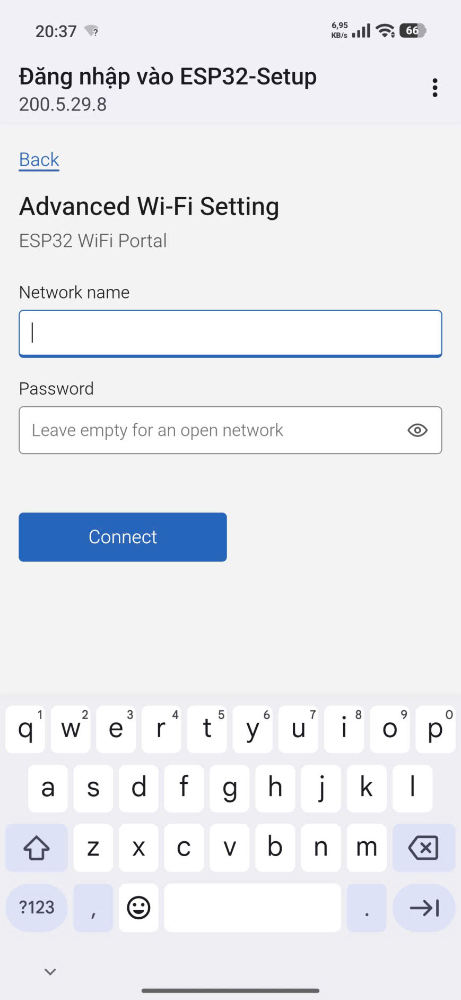
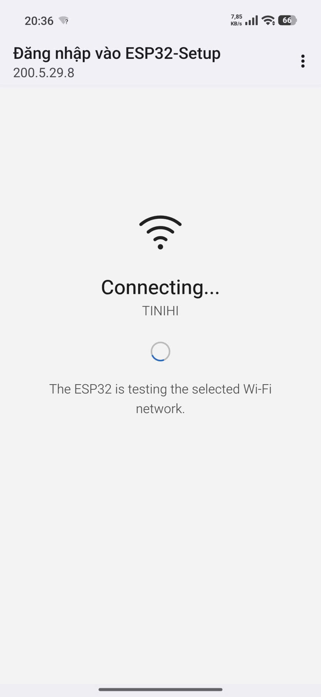

# ESP32WiFiPortal 2.1.2


[](https://github.com/NguyenHien-8/ESP32WiFiPortal/blob/master/LICENSE)
[](https://www.espressif.com/en/products/socs/esp32)
[](https://www.espressif.com/en/products/socs/esp32-s2)
[](https://www.espressif.com/en/products/socs/esp32-S3)
[](https://www.espressif.com/en/products/socs/esp32-c3)
[](https://www.espressif.com/en/products/socs/esp32-c6)

<p align="center">
  
  
  
  
</p>

## How it works

Upon startup, the ESP enters Station mode and attempts to connect to a previously saved access point.
If this fails (or if no network was previously saved), the ESP switches to Access Point mode and initializes DNS and Web servers (default IP address: 192.168.4.1).
Use any Wi-Fi-enabled device with a web browser (computer, smartphone, or tablet) to connect to the newly created access point.
Due to the Captive Portal and DNS server, a "Join Network" pop-up will appear, or any domain you attempt to visit will be redirected to the configuration portal.
Select one of the scanned access points, enter the password, and click save.
The ESP will attempt to connect. If successful, it returns control to your application; otherwise, it remains on the Wi-Fi Portal interface.

## Features

- SoftAP captive portal with DNS redirection
- Private default portal address: `192.168.4.1`
- Configurable usable-unicast portal address through `setPortalIP(...)`
- Optional static STA IPv4 address, gateway, subnet, and two DNS servers
- Lightweight `WiFi.onEvent()` tracking with disconnect reasons
- Library-managed auto reconnect with bounded retry bursts and capped backoff
- Automatic recovery of the last saved Wi-Fi after an unsuccessful Portal session
- Asynchronous Wi-Fi scanning and CRC-checked single-record NVS credentials
- Power-loss-safe migration from the legacy `ssid`/`pass` key pair
- Advanced manual entry, runtime device properties, and deferred reboot control
- Blocking, non-blocking, and on-demand portal modes
- Safe cancellation of pending STA attempts when the portal stops or times out
- No third-party runtime dependency

## Minimal example

```cpp
#include <ESP32WiFiPortal.h>

ESP32WiFiPortal portal;

void setup() {
  Serial.begin(115200);

  portal.onPortalStarted([]() {
    Serial.print("Open http://");
    Serial.println(portal.portalIP());
  });

  if (!portal.autoConnect("ESP32-Setup", "12345678")) {
    Serial.println(portal.lastError());
  }
}

void loop() {
  // Also drives Wi-Fi events and Auto Reconnect when enabled.
  portal.process();
}
```

The default portal address is `192.168.4.1`. `portalIP()` also returns the
configured address before the portal starts.

## Custom portal IP

Configure the portal before starting it:

```cpp
if (!portal.setPortalIP(IPAddress(200, 5, 29, 8))) {
  Serial.println(portal.lastError());
}
```

The one-argument overload uses the local IP as gateway and a
`255.255.255.0` (`/24`) subnet, so the example is available at
`http://200.5.29.8/`. An explicit network can also be supplied:

```cpp
portal.setPortalIP(
    IPAddress(10, 10, 0, 1),
    IPAddress(10, 10, 0, 1),
    IPAddress(255, 255, 255, 0));
```

Portal addresses are not limited to RFC 1918. Usable unicast addresses in the
legacy Class A, B, and C ranges are accepted, for example `10.10.0.1/24`,
`150.10.20.1/24`, and `200.5.29.8/24`. Class A/B/C describes only the legacy
address ranges; the actual network uses CIDR, and the library never infers a
`/8` or `/16` mask from the first octet.

The local IP and gateway must be usable host addresses in the same contiguous
subnet; zero/`0.x.x.x`, loopback, multicast/reserved, network, and broadcast
addresses are rejected. Portal subnets are restricted to `/24` through `/28`,
matching the DHCP range supported by current Arduino-ESP32 SoftAP cores. The
Portal IP and gateway also cannot overlap the default lease pool that the core
derives from the selected Portal IP. The configuration cannot be changed while
the portal is active. After
`WiFi.softAPConfig()` succeeds, the library reads back the runtime SoftAP IP and
subnet before starting DNS and HTTP; a mismatch is cleaned up and reported.

Prefer a private RFC 1918 address in deployed products to avoid routing
collisions. `200.5.29.8` looks public and is globally routable outside the local
SoftAP; it is supported for local Portal use and testing, but is deliberately
not the default. The safe, source-compatible default remains `192.168.4.1/24`.

## Static STA IP and DNS

STA addressing is independent from the SoftAP/Portal address. DHCP remains the
default. To apply a static configuration to subsequent library-managed
connections:

```cpp
if (!portal.setSTAStaticIP(
        IPAddress(192, 168, 1, 50),
        IPAddress(192, 168, 1, 1),
        IPAddress(255, 255, 255, 0),
        IPAddress(1, 1, 1, 1),
        IPAddress(8, 8, 8, 8))) {
  Serial.println(portal.lastError());
}
```

The address and gateway must be distinct usable hosts in the same contiguous
subnet. DNS addresses are optional; a secondary DNS requires a primary DNS.
Call `useSTADHCP()` to restore DHCP for the next connection attempt.

## Events, retry, and Auto Reconnect

The library registers one Arduino-ESP32 Wi-Fi event handler. Its callback only
records atomic flags and the disconnect reason; state transitions, logging,
retry, DNS, and WebServer work remain in application context.

```cpp
portal.setConnectTimeout(10000);
portal.setConnectionRetryPolicy(3, 2000, 60000);
portal.setAutoReconnect(true);
```

`setConnectionRetryPolicy()` configures retries after the initial attempt, the
initial backoff, and its cap. Portal candidates and blocking saved connections
stop after the configured finite retries. Auto Reconnect also uses finite retry
bursts, then waits for the capped cooldown before starting another burst so a
device can recover from a long router outage without creating a reconnect storm.
Authentication and handshake failures from previously saved credentials remain
recoverable because the same ESP32 reason codes can also be caused by weak
signal, packet loss, an overloaded AP, or a restarting router. A new Portal
candidate can still be rejected on a clear authentication failure and is never
saved unless it connects successfully.
For safety, the initial interval must be at least 250 ms and the cap at least
1000 ms.

`setConnectTimeout(0)` and `connectSaved(0)` are normalized to the safe
15-second default and emit a short log message. Portal, blocking saved, and Auto
Reconnect attempts therefore never acquire the old infinite-timeout behavior.
All reconnect deadlines, backoff intervals, and cooldowns use unsigned
`millis()` subtraction and remain valid across timer wrap-around.

Auto Reconnect is enabled by default to preserve normal Arduino-ESP32 behavior;
use `setAutoReconnect(false)` to disable it. Call `process()` frequently from
`loop()` whenever Auto Reconnect is enabled. The
library disables the Arduino core's own automatic reconnect while it is managing
Wi-Fi, preventing two independent policies from racing. `lastDisconnectReason()`
returns the latest ESP32 reason code processed by the state machine.
If a blocking `connectSaved()` attempt returns `false`, its saved credentials
are also scheduled for background recovery; a following `autoConnect()` Portal
start cancels that schedule before taking ownership of the STA interface.

Short Serial logs are enabled by default for Portal, Connect, Got IP, Disconnect,
Retry, and Reconnect transitions. Passwords are never logged. Use
`setLogging(false)` when the application needs silent operation.

## Credential persistence and migration

Credentials are stored as one fixed-size `cred_blob` record in the
`ewp_wifi` Preferences namespace. The record contains a magic value, format
version, encoded size, explicit SSID/password byte lengths, fixed-capacity
payloads, and a CRC32 (IEEE polynomial `0xEDB88320`). A save uses one
`putBytes()` call, then reads the complete record back and validates its metadata,
lengths, value, and CRC before the in-memory reconnect cache is changed.

On first use after upgrading, a valid legacy `ssid`/`pass` pair is converted to
the blob. The legacy keys are removed only after verified read-back. If power is
lost during that write, the complete legacy pair remains the recovery source;
if a blob is corrupt and no complete legacy pair exists, it is rejected and is
never passed to `WiFi.begin()`. `eraseCredentials()` removes the blob and both
legacy keys.

CRC detects accidental corruption and interrupted writes; it is not encryption,
authentication, or tamper protection. Preferences/NVS access control and device
physical security remain application/deployment responsibilities.

## Captive portal UI

The normal scan list remains the default view. The underlined **Advanced View**
link opens offline SPA views for manual credentials, runtime device properties,
and restart. Manual SSIDs are submitted exactly as entered, including
leading/trailing spaces, and are validated as 1-32 bytes. Passwords must be empty
for an open network or 8-63 bytes for a secured network. The password is sent
only by POST to `/save`, is never placed in a URL or browser storage, and the
existing connection state machine prevents double submission. Properties are
fetched only when their view opens, and Reset uses a POST followed by a deferred
restart in `process()` without erasing credentials.

The scan progress indicator uses a fixed-width translated bar with linear
infinite motion. It never scales or changes shape, and it becomes static when
the browser requests reduced motion.

## Cooperative runtime

`process()` advances STA connection setup in short phases: disconnect, a
`millis()`-based settle interval, IP configuration, and `WiFi.begin()`. Auto
Reconnect timeouts, retry backoff, cooldown, and Portal scans also use state and
timestamps; `/scan` returns HTTP `202` while the ESP32 scan runs and the existing
Portal page polls until results are ready. DNS, HTTP, Wi-Fi events, and connection
state therefore continue to be serviced between scan updates.

Cooperative operation still depends on the application calling `process()`
frequently. Prefer `startConfigPortalAsync()` for runtime configuration, schedule
application work with `millis()`, and avoid long `delay()` calls or blocking
HTTP/TLS operations in `loop()`. The existing `connectSaved()`, `autoConnect()`,
and `startConfigPortal()` APIs intentionally retain their blocking behavior for
source compatibility.

## Portal timeout and stop behavior

Both blocking and asynchronous modes use the same state machine. When a portal
timeout or `stopConfigPortal()` occurs during a new STA connection attempt, the
library disconnects that attempt, clears pending credentials from RAM, stops the
HTTP server and DNS, and shuts down only the SoftAP interface. Stored credentials
are not modified until a new STA connection succeeds. If the device is then
offline and valid credentials were already stored, it schedules a non-blocking
Auto Reconnect with those previous credentials. This recovery uses the normal
retry/cooldown policy and never reopens the Portal automatically.

If the ESP32 was already connected before opening the portal and no replacement
attempt is running, stopping the portal leaves that STA connection intact. A
timed-out blocking portal returns `false` when no STA connection remains; async
code can inspect `state()` and `lastError()` after `process()`. In either mode,
subsequent calls to `process()` drive any scheduled recovery of the old Wi-Fi.

For deployed devices, prefer an explicit button or other local action before
opening configuration mode. See `examples/OnDemand`.

## API summary

```cpp
bool connectSaved(uint32_t timeoutMs = 15000);
bool autoConnect(const char* apSSID = "ESP32-Setup",
                 const char* apPassword = nullptr,
                 uint32_t connectTimeoutMs = 15000,
                 uint32_t portalTimeoutMs = 0);
bool startConfigPortal(const char* apSSID = "ESP32-Setup",
                       const char* apPassword = nullptr,
                       uint32_t portalTimeoutMs = 0);
bool startConfigPortalAsync(const char* apSSID = "ESP32-Setup",
                            const char* apPassword = nullptr,
                            uint32_t portalTimeoutMs = 0);
void process();
void stopConfigPortal();

bool setPortalIP(const IPAddress& localIP);
bool setPortalIP(const IPAddress& localIP,
                 const IPAddress& gateway,
                 const IPAddress& subnet);

bool setSTAStaticIP(const IPAddress& localIP,
                    const IPAddress& gateway,
                    const IPAddress& subnet,
                    const IPAddress& primaryDNS = IPAddress(),
                    const IPAddress& secondaryDNS = IPAddress());
void useSTADHCP();
bool isSTAStaticIPConfigured() const;
void setAutoReconnect(bool enabled);
bool autoReconnectEnabled() const;
bool setConnectionRetryPolicy(uint8_t retryCount,
                              uint32_t retryIntervalMs,
                              uint32_t maxRetryIntervalMs);
void setConnectTimeout(uint32_t timeoutMs);
void setLogging(bool enabled);
uint8_t lastDisconnectReason() const;

bool eraseCredentials(bool disconnect = true);
```

## Changes in 2.1.2

- Advanced View now separates Manual Configure WiFi, runtime Properties, and
  Reset into responsive offline SPA views.
- `GET /properties` reports current ESP32, SoftAP, STA, and MAC information
  without exposing Wi-Fi passwords or polling in the background.
- `POST /reset` acknowledges the request before a cooperative, wrap-safe,
  deferred restart; saved credentials remain intact.
- Manual credentials still use the existing `/save` validation and connection
  state machine, preserving exact SSID bytes.

## Changes in 2.1.1

- Existing public APIs remain source-compatible.
- The default SoftAP address remains `192.168.4.1/24`.
- Portal IPs may use any valid unicast Class A/B/C address, while SoftAP DHCP
  subnets are explicitly limited to `/24` through `/28`.
- Portal validation mirrors the target core's default DHCP lease placement, so
  an IP or gateway inside that lease pool is rejected before Portal startup.
- Allocation-free IPv4 validation is now encapsulated by private, inline helpers
  in the core `ESP32WiFiPortal` class; applications still include only
  `ESP32WiFiPortal.h`.
- The default connection retry count is zero. Auto Reconnect remains enabled by
  default, but now uses the bounded library policy instead of an independent
  core reconnect loop.
- The captive portal remains HTTP on the isolated setup AP. Use a strong AP
  password and do not expose the setup network to untrusted clients.
- Credentials now use one versioned, CRC-checked blob with automatic legacy-key
  migration and verified read-back before cache commit.
- `setConnectTimeout(0)` now selects 15000 ms instead of an infinite Portal or
  Auto Reconnect attempt.
- The Portal includes Advanced manual SSID/password entry without trimming SSID
  whitespace.

## License

Apache License V2.0
