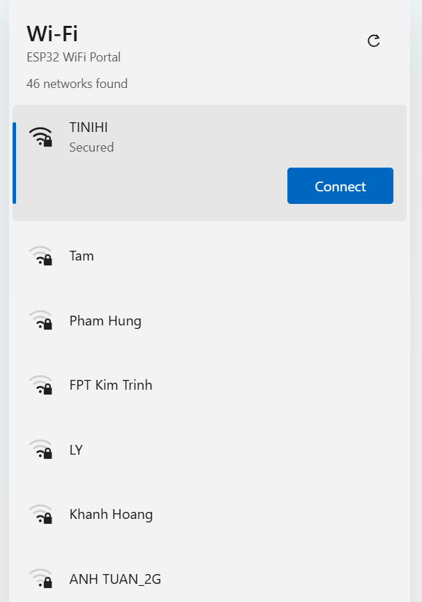
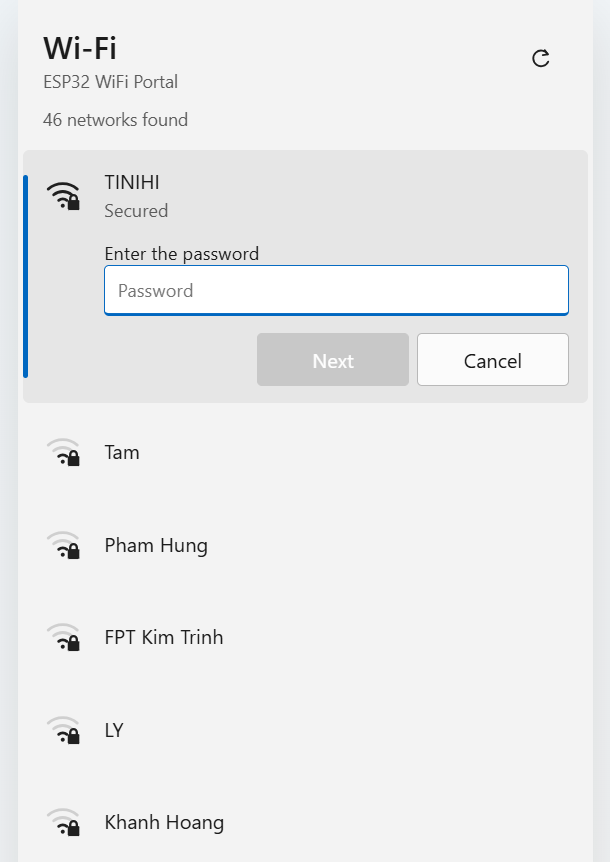
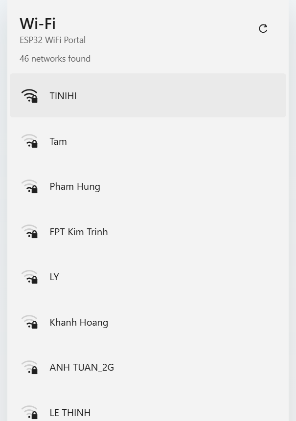
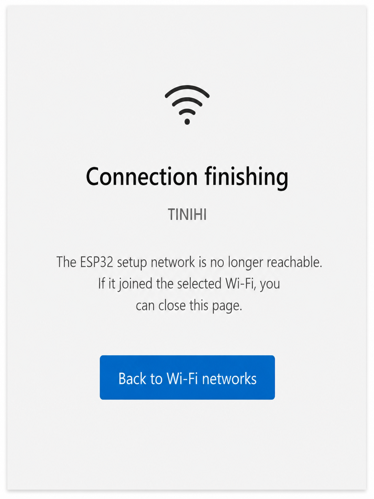

# ESP32WiFiPortal 1.1.1

ESP32-only Wi-Fi provisioning library for Arduino-ESP32.

<p align="center">
  
  
  
  
</p>

## Features

- SoftAP captive portal with DNS redirection
- Private default portal address: `192.168.4.1`
- Configurable portal address through `setPortalIP(...)`
- Optional static STA IPv4 address, gateway, subnet, and two DNS servers
- Lightweight `WiFi.onEvent()` tracking with disconnect reasons
- Library-managed auto reconnect with bounded retry bursts and capped backoff
- Wi-Fi scanning and Preferences/NVS credential storage
- Blocking, non-blocking, and on-demand portal modes
- Safe cancellation of pending STA attempts when the portal stops or times out
- No third-party runtime dependency

## Minimal example

```cpp
#include <ESP32WiFiPortal.h>

ESP32WiFiPortal portal;

void setup() {
  Serial.begin(115200);

  portal.onPortalStarted([]() {
    Serial.print("Open http://");
    Serial.println(portal.portalIP());
  });

  if (!portal.autoConnect("ESP32-Setup", "12345678")) {
    Serial.println(portal.lastError());
  }
}

void loop() {
  // Also drives Wi-Fi events and Auto Reconnect when enabled.
  portal.process();
}
```

The default portal address is `192.168.4.1`. `portalIP()` also returns the
configured address before the portal starts.

## Custom portal IP

Configure the portal before starting it:

```cpp
if (!portal.setPortalIP(IPAddress(192, 168, 50, 1))) {
  Serial.println(portal.lastError());
}
```

The one-argument overload uses the local IP as gateway and a
`255.255.255.0` subnet. An explicit network can also be supplied:

```cpp
portal.setPortalIP(
    IPAddress(10, 10, 0, 1),
    IPAddress(10, 10, 0, 1),
    IPAddress(255, 255, 255, 0));
```

Only usable RFC 1918 host addresses are accepted. The address and gateway must
belong to the same valid subnet. The configuration cannot be changed while the
portal is active.

## Static STA IP and DNS

STA addressing is independent from the SoftAP/Portal address. DHCP remains the
default. To apply a static configuration to subsequent library-managed
connections:

```cpp
if (!portal.setSTAStaticIP(
        IPAddress(192, 168, 1, 50),
        IPAddress(192, 168, 1, 1),
        IPAddress(255, 255, 255, 0),
        IPAddress(1, 1, 1, 1),
        IPAddress(8, 8, 8, 8))) {
  Serial.println(portal.lastError());
}
```

The address and gateway must be distinct usable hosts in the same contiguous
subnet. DNS addresses are optional; a secondary DNS requires a primary DNS.
Call `useSTADHCP()` to restore DHCP for the next connection attempt.

## Events, retry, and Auto Reconnect

The library registers one Arduino-ESP32 Wi-Fi event handler. Its callback only
records atomic flags and the disconnect reason; state transitions, logging,
retry, DNS, and WebServer work remain in application context.

```cpp
portal.setConnectTimeout(10000);
portal.setConnectionRetryPolicy(3, 2000, 60000);
portal.setAutoReconnect(true);
```

`setConnectionRetryPolicy()` configures retries after the initial attempt, the
initial backoff, and its cap. Portal candidates and blocking saved connections
stop after the configured finite retries. Auto Reconnect also uses finite retry
bursts, then waits for the capped cooldown before starting another burst so a
device can recover from a long router outage without creating a reconnect storm.
Authentication and handshake failures are terminal and do not enter that loop.
For safety, the initial interval must be at least 250 ms and the cap at least
1000 ms.

Auto Reconnect is enabled by default to preserve normal Arduino-ESP32 behavior;
use `setAutoReconnect(false)` to disable it. Call `process()` frequently from
`loop()` whenever Auto Reconnect is enabled. The
library disables the Arduino core's own automatic reconnect while it is managing
Wi-Fi, preventing two independent policies from racing. `lastDisconnectReason()`
returns the latest ESP32 reason code processed by the state machine.

Short Serial logs are enabled by default for Portal, Connect, Got IP, Disconnect,
Retry, and Reconnect transitions. Passwords are never logged. Use
`setLogging(false)` when the application needs silent operation.

## Portal timeout and stop behavior

Both blocking and asynchronous modes use the same state machine. When a portal
timeout or `stopConfigPortal()` occurs during a new STA connection attempt, the
library disconnects that attempt, clears pending credentials from RAM, stops the
HTTP server and DNS, and shuts down only the SoftAP interface. Stored credentials
are not modified until a new STA connection succeeds.

If the ESP32 was already connected before opening the portal and no replacement
attempt is running, stopping the portal leaves that STA connection intact. A
timed-out blocking portal returns `false` when no STA connection remains; async
code can inspect `state()` and `lastError()` after `process()`.

For deployed devices, prefer an explicit button or other local action before
opening configuration mode. See `examples/OnDemand`.

## API summary

```cpp
bool connectSaved(uint32_t timeoutMs = 15000);
bool autoConnect(const char* apSSID = "ESP32-Setup",
                 const char* apPassword = nullptr,
                 uint32_t connectTimeoutMs = 15000,
                 uint32_t portalTimeoutMs = 0);
bool startConfigPortal(const char* apSSID = "ESP32-Setup",
                       const char* apPassword = nullptr,
                       uint32_t portalTimeoutMs = 0);
bool startConfigPortalAsync(const char* apSSID = "ESP32-Setup",
                            const char* apPassword = nullptr,
                            uint32_t portalTimeoutMs = 0);
void process();
void stopConfigPortal();

bool setPortalIP(const IPAddress& localIP);
bool setPortalIP(const IPAddress& localIP,
                 const IPAddress& gateway,
                 const IPAddress& subnet);

bool setSTAStaticIP(const IPAddress& localIP,
                    const IPAddress& gateway,
                    const IPAddress& subnet,
                    const IPAddress& primaryDNS = IPAddress(),
                    const IPAddress& secondaryDNS = IPAddress());
void useSTADHCP();
bool isSTAStaticIPConfigured() const;
void setAutoReconnect(bool enabled);
bool autoReconnectEnabled() const;
bool setConnectionRetryPolicy(uint8_t retryCount,
                              uint32_t retryIntervalMs,
                              uint32_t maxRetryIntervalMs);
void setConnectTimeout(uint32_t timeoutMs);
void setLogging(bool enabled);
uint8_t lastDisconnectReason() const;

bool eraseCredentials(bool disconnect = true);
```

## Compatibility notes for 1.1.1

- Existing public APIs remain source-compatible.
- The default SoftAP address changed from `200.5.29.8` to `192.168.4.1`.
- `setPortalIP(...)` is additive; existing sketches need no source changes.
- The default connection retry count is zero. Auto Reconnect remains enabled by
  default, but now uses the bounded library policy instead of an independent
  core reconnect loop.
- The captive portal remains HTTP on the isolated setup AP. Use a strong AP
  password and do not expose the setup network to untrusted clients.

## Repository layout

```text
ESP32WiFiPortal/
├── src/
│   ├── ESP32WiFiPortal.cpp
│   ├── ESP32WiFiPortal.h
│   └── PortalPage.h
├── examples/
│   ├── Basic/
│   ├── AdvancedSTA/
│   ├── CustomIP/
│   ├── NonBlocking/
│   ├── OnDemand/
│   └── Test/
├── docs/
│   ├── ARCHITECTURE.md
│   └── FlowChart.md
├── library.properties
└── library.json
```

## License

Apache License V2.0
