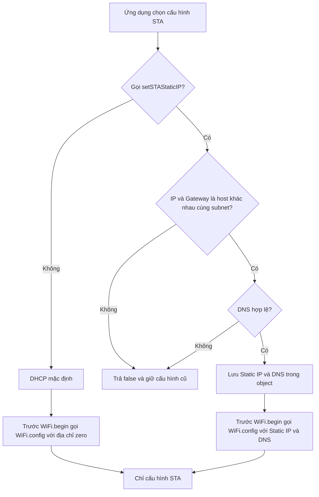
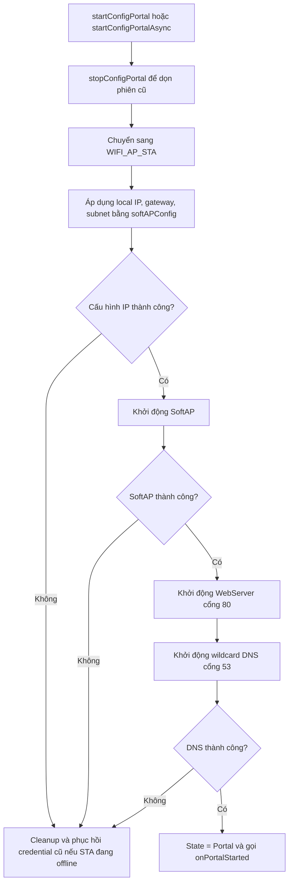
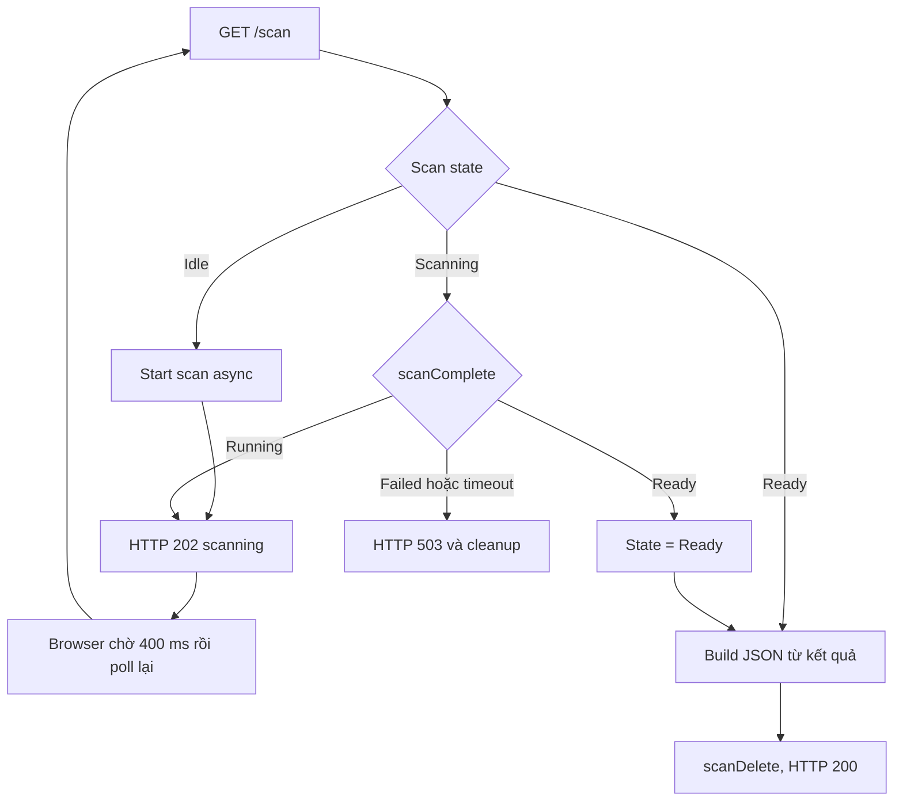
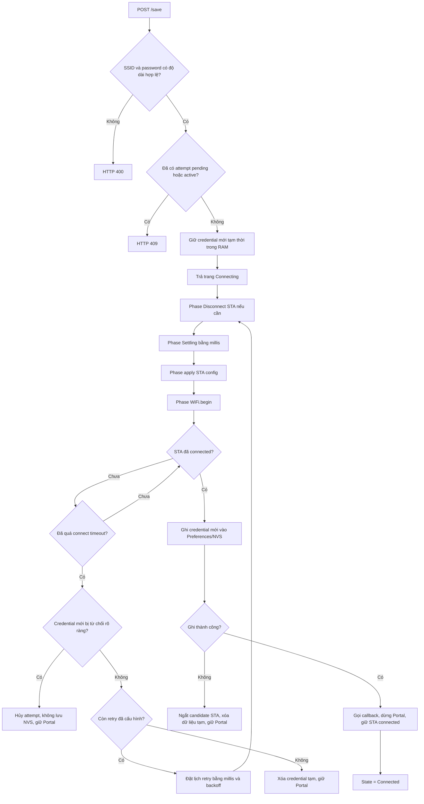
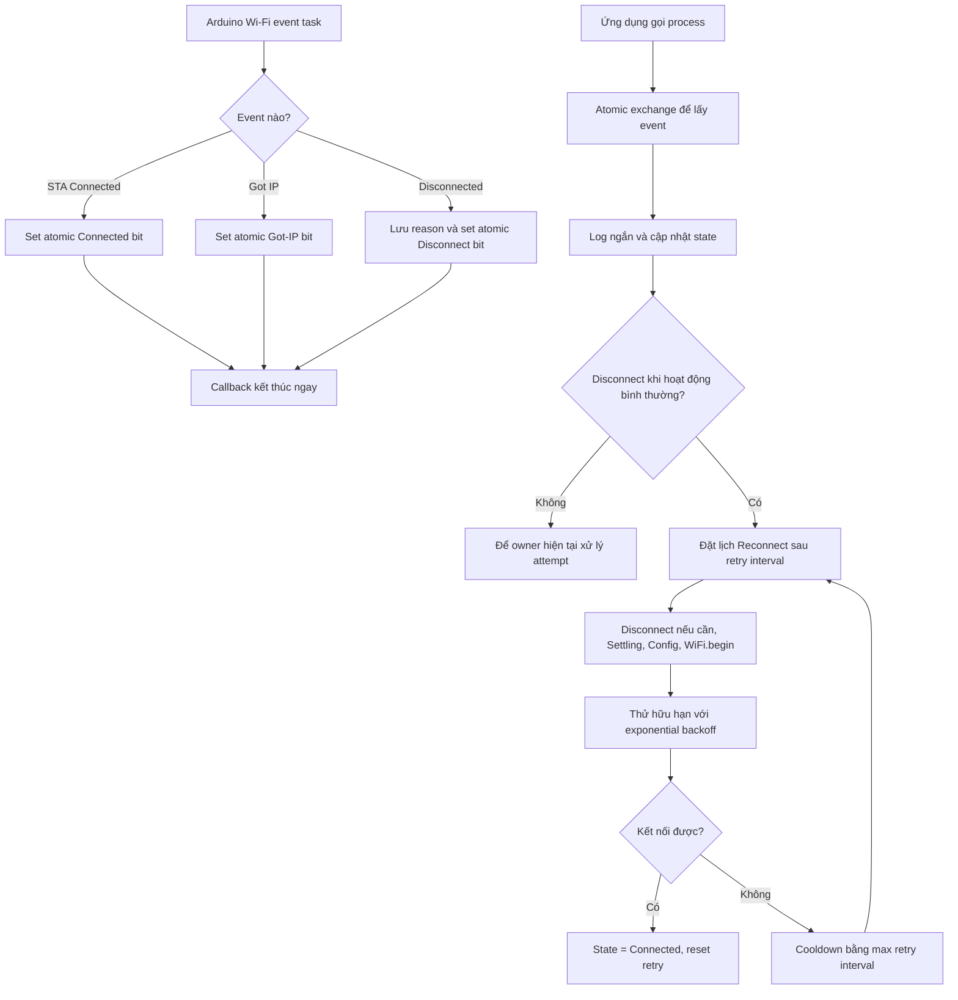
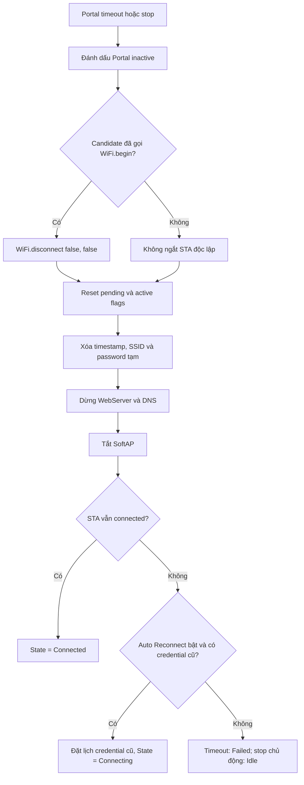
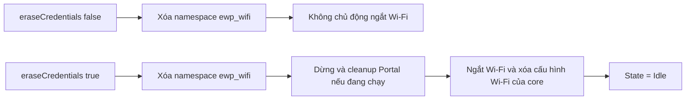

# Lưu đồ hoạt động ESP32WiFiPortal 1.1.1

Tài liệu này mô tả state machine chung cho kết nối blocking, Config Portal
non-blocking, Wi-Fi event, retry và Auto Reconnect.

## Cấu hình địa chỉ STA



`useSTADHCP()` chọn lại DHCP cho lần kết nối do thư viện quản lý tiếp theo. Cấu
hình STA không đọc hoặc thay đổi Portal IP của SoftAP.

## Khởi động và kết nối credential đã lưu


`connectSaved()` chỉ đọc namespace `ewp_wifi`; lỗi kết nối không xóa credential
đã lưu. Nếu một Portal đang hoạt động, thư viện dừng và dọn Portal trước khi
chuyển sang `WIFI_STA`. Khi Auto Reconnect bật, một lần blocking thất bại vẫn
đặt lịch thử lại non-blocking; `autoConnect()` sẽ hủy lịch này khi chuyển ngay
sang Portal nên không có hai owner kết nối.

## Khởi tạo Config Portal



Portal IP được giữ cố định trong suốt phiên đang chạy. `setPortalIP()` trả
`false` nếu được gọi khi Portal còn active, nhờ đó SoftAP, DNS và HTTP redirect
luôn dùng cùng một địa chỉ.

## Wi-Fi scan non-blocking trong Portal



Scan driver chạy asynchronous nên mỗi lần `process()` chỉ poll trạng thái rồi
tiếp tục phục vụ DNS, HTTP và state machine. Portal stop hoặc một yêu cầu kết nối
hợp lệ sẽ hủy scan đang chạy và giải phóng kết quả; không có hai scan đồng thời.

## Nhận và thử credential mới



Credential cũ trong NVS không bị thay đổi khi candidate không kết nối được hoặc
khi Portal hết thời gian. Việc ghi chỉ diễn ra sau khi `WL_CONNECTED`. Handshake
timeout không tự động chứng minh password sai vì cũng có thể do sóng yếu hoặc AP
đang restart.

## Wi-Fi event và Auto Reconnect



Arduino-ESP32 Auto Reconnect được tắt khi event handler của thư viện được cài.
Nhờ đó chỉ có state machine này gọi `WiFi.begin()` và hủy attempt. Lỗi mất AP là
tạm thời nên sau cooldown thiết bị vẫn có thể phục hồi. Với credential đã lưu,
`AUTH_FAIL` và handshake timeout cũng tiếp tục theo cooldown vì các reason này
có thể xuất hiện do packet loss, AP quá tải hoặc router restart. Nếu password
thực sự đã đổi, cooldown giới hạn tần suất thử và tránh reconnect storm. Callback
không gọi Serial, DNS, WebServer, Preferences hoặc API Wi-Fi blocking.

## Timeout, stop và restart Portal



Trong blocking mode, vòng lặp kết thúc ngay khi `_portalActive` thành `false`.
Trong non-blocking mode, ứng dụng phải gọi `process()` thường xuyên. Vì cả hai
đều dùng cùng state machine, hành vi timeout và cleanup là nhất quán, không còn
STA candidate tiếp tục chạy nền. Nếu credential cũ hợp lệ còn trong cache/NVS,
`process()` phục hồi nó bằng Auto Reconnect non-blocking và không tự mở lại Portal.
Khi restart Portal, lịch phục hồi tạm thời được hủy trước khi phiên Portal mới bắt
đầu nên không có hai owner gọi `WiFi.begin()`.

## Quản lý credential chủ động



`eraseCredentials()` là thao tác xóa duy nhất do API công khai yêu cầu. Connect
timeout, Portal timeout và `stopConfigPortal()` không xóa credential đã lưu.

## Luồng hoạt động thư viện ESP32WiFiPortal

```
KHỞI ĐỘNG
    ↓
Đọc credential từ NVS → cache RAM
    ↓
Thử STA connection
    │
    ├──────── Thành công
    │             ↓
    │         Connected
    │             ↓
    │      Theo dõi WiFi Event
    │             ↓
    │        WiFi Disconnect
    │             ↓
    │      Schedule Auto Reconnect
    │             ↓
    │          WIFI_STA
    │             ↓
    │       Reconnect WiFi cũ
    │          │
    │          ├── Success
    │          │      ↓
    │          │  Connected
    │          │
    │          └── Fail
    │                 ↓
    │            Retry/Backoff
    │                 ↓
    │            Hết retry burst
    │                 ↓
    │              Cooldown
    │                 ↓
    │          Reconnect WiFi cũ
    │                 ↓
    │                ...
    │
    └──────── Thất bại lúc startup
                  ↓
             Config Portal
                  ↓
              WIFI_AP_STA
                  ↓
          DNS + WebServer + SoftAP
                  ↓
              Scan WiFi
                  ↓
          User nhập credential mới
                  ↓
             Thử kết nối
              │
              ├── Fail
              │     ↓
              │  Giữ Portal
              │
              │  Nếu Portal timeout/stop
              │        ↓
              │  Credential cũ còn?
              │        │
              │    ┌───┴───┐
              │   Yes      No
              │    ↓        ↓
              │ Tắt AP    Idle/Failed
              │    ↓
              │ WIFI_STA
              │    ↓
              │ Auto Reconnect
              │ WiFi cũ
              │
              └── Success
                    ↓
              Lưu NVS
                    ↓
              cập nhật cache
                    ↓
              Tắt Portal
                    ↓
                Connected
```
