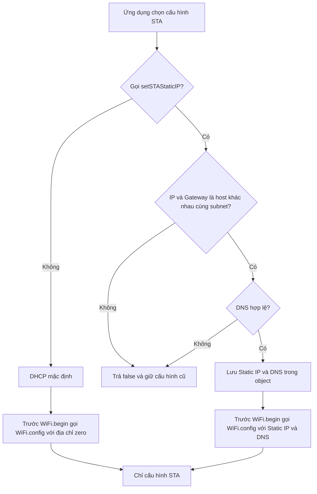
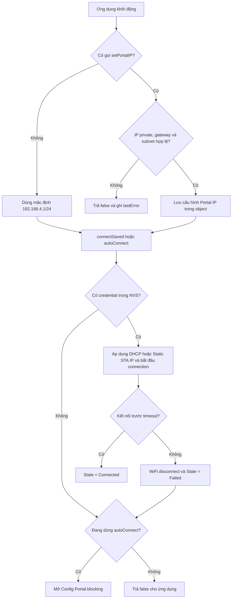
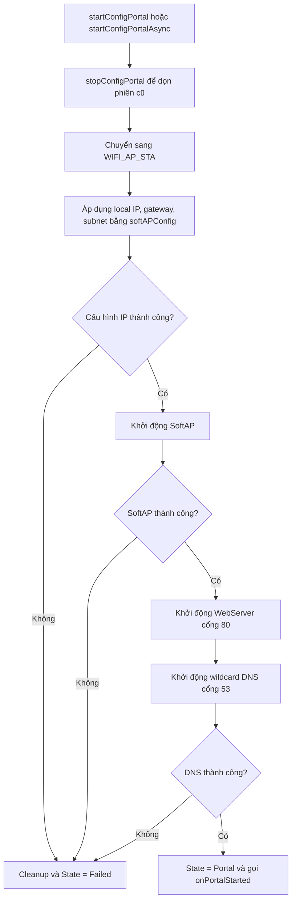
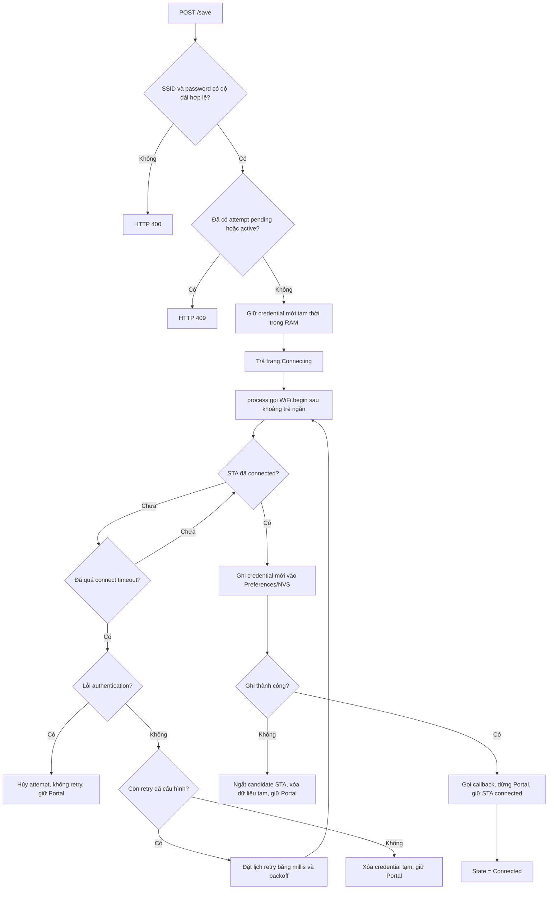
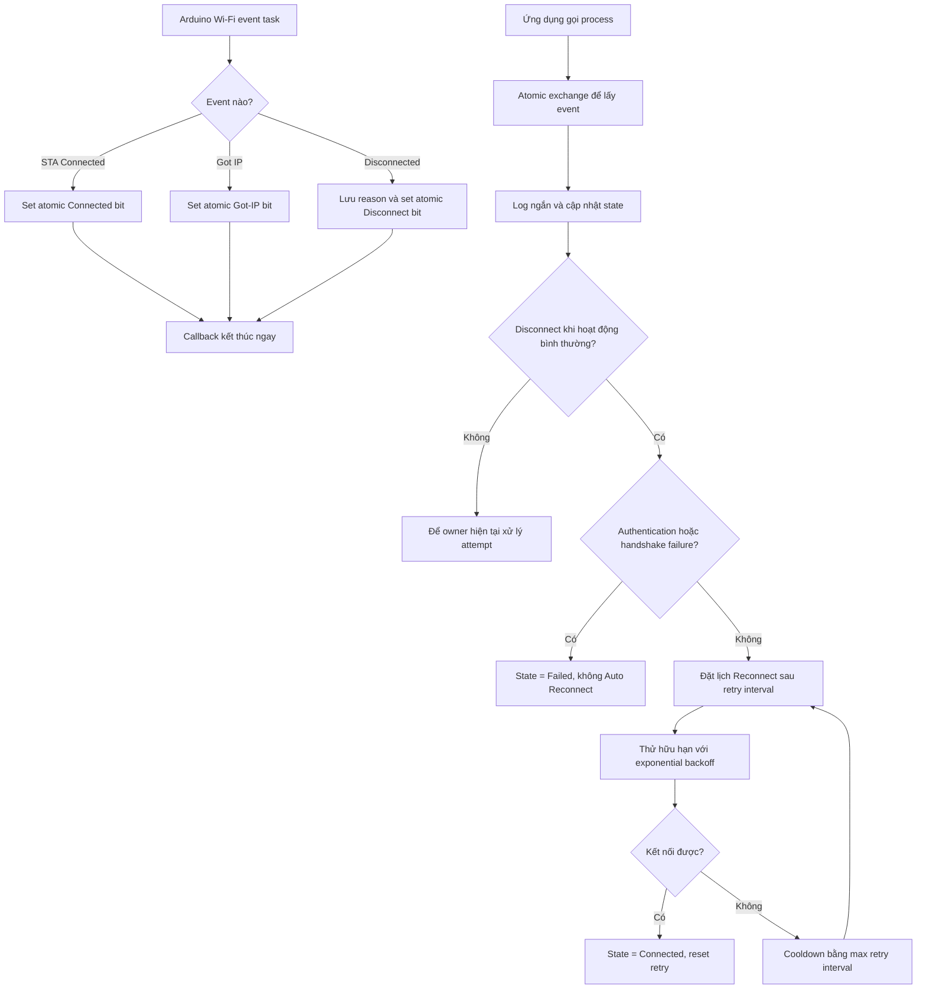
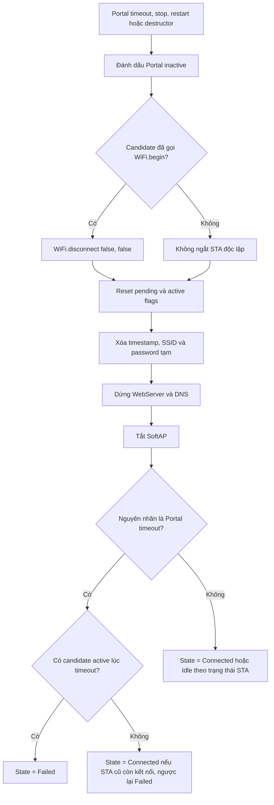
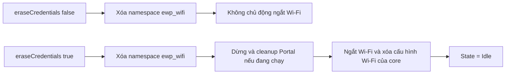

# Lưu đồ hoạt động ESP32WiFiPortal 1.1.1

Tài liệu này mô tả state machine chung cho kết nối blocking, Config Portal
non-blocking, Wi-Fi event, retry và Auto Reconnect.

## Cấu hình địa chỉ STA

`useSTADHCP()` chọn lại DHCP cho lần kết nối do thư viện quản lý tiếp theo. Cấu
hình STA không đọc hoặc thay đổi Portal IP của SoftAP.

## Khởi động và kết nối credential đã lưu

`connectSaved()` chỉ đọc namespace `ewp_wifi`; lỗi kết nối không xóa credential
đã lưu. Nếu một Portal đang hoạt động, thư viện dừng và dọn Portal trước khi
chuyển sang `WIFI_STA`.

## Khởi tạo Config Portal

Portal IP được giữ cố định trong suốt phiên đang chạy. `setPortalIP()` trả
`false` nếu được gọi khi Portal còn active, nhờ đó SoftAP, DNS và HTTP redirect
luôn dùng cùng một địa chỉ.

## Nhận và thử credential mới

Credential cũ trong NVS không bị thay đổi khi candidate không kết nối được hoặc
khi Portal hết thời gian. Việc ghi chỉ diễn ra sau khi `WL_CONNECTED`.

## Wi-Fi event và Auto Reconnect

Arduino-ESP32 Auto Reconnect được tắt khi event handler của thư viện được cài.
Nhờ đó chỉ có state machine này gọi `WiFi.begin()` và hủy attempt. Lỗi mất AP là
tạm thời nên sau cooldown thiết bị vẫn có thể phục hồi; lỗi password dừng hẳn.
Callback không gọi Serial, DNS, WebServer, Preferences hoặc API Wi-Fi blocking.

## Timeout, stop và restart Portal

Trong blocking mode, vòng lặp kết thúc ngay khi `_portalActive` thành `false`.
Trong non-blocking mode, ứng dụng phải gọi `process()` thường xuyên. Vì cả hai
đều dùng cùng state machine, hành vi timeout và cleanup là nhất quán, không còn
STA attempt tiếp tục chạy nền sau khi state đã chuyển sang thất bại.

## Quản lý credential chủ động

`eraseCredentials()` là thao tác xóa duy nhất do API công khai yêu cầu. Connect
timeout, Portal timeout và `stopConfigPortal()` không xóa credential đã lưu.
