# Lưu đồ hoạt động ESP32WiFiPortal 2.1.2

Tài liệu này mô tả state machine của `ESP32WiFiPortal` 2.1.2 cho kết nối blocking, Config Portal blocking/non-blocking, Wi-Fi event, retry, Auto Reconnect và Wi-Fi scan bất đồng bộ.

## Cấu hình địa chỉ STA

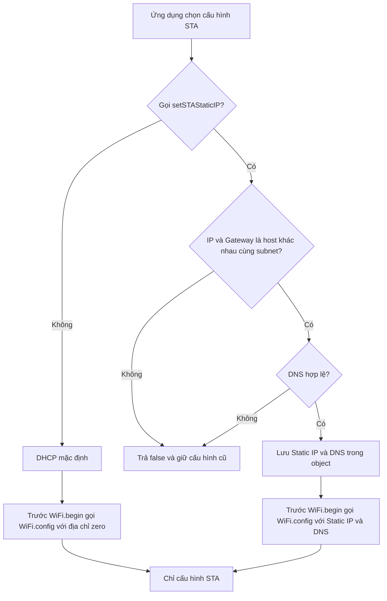

`useSTADHCP()` chọn lại DHCP cho lần kết nối do thư viện quản lý tiếp theo. Cấu
hình STA không đọc hoặc thay đổi Portal IP của SoftAP.

## Khởi động và kết nối credential đã lưu

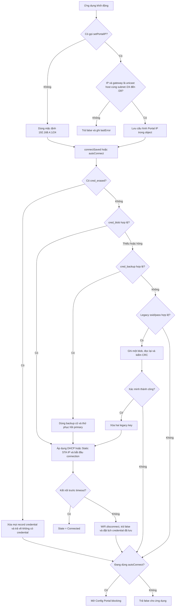

`connectSaved()` đọc namespace `ewp_wifi`; lỗi kết nối không xóa credential đã
lưu. Record hỏng bị từ chối và không được Auto Reconnect sử dụng; lỗi mở NVS tạm
thời được thử lại sau cooldown. Nếu một Portal đang hoạt động, thư viện dừng và dọn Portal trước khi
chuyển sang `WIFI_STA`. Khi Auto Reconnect bật, một lần blocking thất bại vẫn
đặt lịch thử lại non-blocking; `autoConnect()` sẽ hủy lịch này khi chuyển ngay
sang Portal nên không có hai owner kết nối.

## Khởi tạo Config Portal

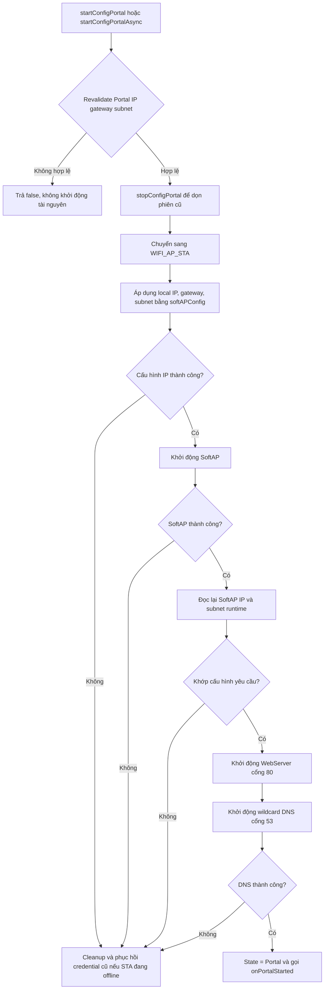

Portal IP được giữ cố định trong suốt phiên đang chạy. `setPortalIP()` trả
`false` nếu được gọi khi Portal còn active, nhờ đó SoftAP, DNS và HTTP redirect
luôn dùng cùng một địa chỉ.

Validator chấp nhận unicast Class A/B/C hợp lệ nhưng dùng CIDR `/24` đến `/28`
cho DHCP SoftAP; không suy ra classful `/8` hoặc `/16`. RFC 1918 vẫn được khuyến
nghị để tránh xung đột route. `200.5.29.8/24` được hỗ trợ cho SoftAP cục bộ nhưng
không thay thế default an toàn `192.168.4.1/24`.

Validator cũng tính trước lease pool mặc định của Arduino-ESP32 3.3.11 và từ
chối IP/gateway nằm trong pool, tránh trường hợp setter thành công nhưng
`softAPConfig()` chắc chắn thất bại khi khởi động.

Các phép kiểm tra IPv4 thuần được đóng gói thành helper `private static inline`
ngay trong class `ESP32WiFiPortal`. Vì vậy thư viện chỉ có một implementation,
không mở rộng public API, không cấp phát heap khi validate và không phát sinh
multiple-definition khi nhiều translation unit cùng include header chính.

## Wi-Fi scan non-blocking trong Portal

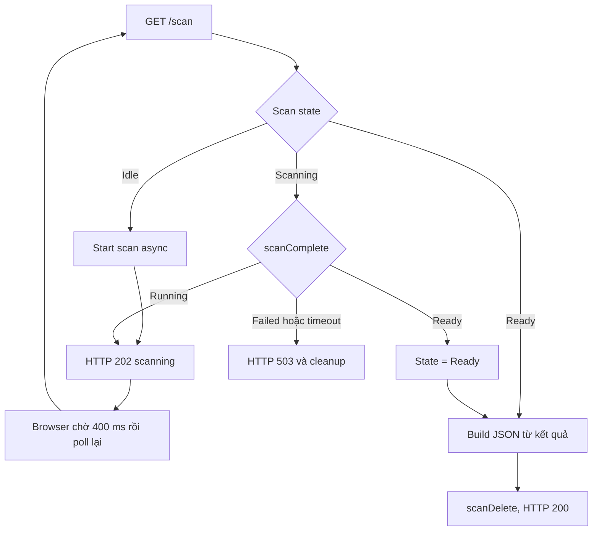

Scan driver chạy asynchronous nên mỗi lần `process()` chỉ poll trạng thái rồi
tiếp tục phục vụ DNS, HTTP và state machine. Portal stop hoặc một yêu cầu kết nối
hợp lệ sẽ hủy scan đang chạy và giải phóng kết quả; không có hai scan đồng thời.

## Nhận và thử credential mới

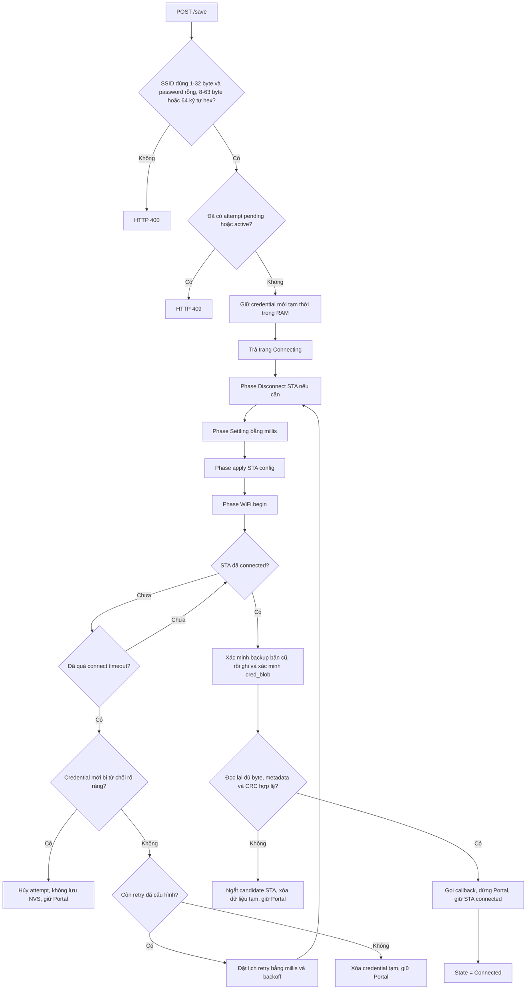

Credential cũ trong NVS không bị thay đổi khi candidate không kết nối được hoặc
khi Portal hết thời gian. Việc ghi chỉ diễn ra sau khi `WL_CONNECTED`. Handshake
timeout không tự động chứng minh password sai vì cũng có thể do sóng yếu hoặc AP
đang restart.

SSID từ cả danh sách scan và **Advanced Wi-Fi Setting** được giữ nguyên byte,
không gọi `trim()`. Advanced view dùng cùng POST `/save`, cùng candidate RAM và
cùng state machine; password không nằm trong URL hoặc browser storage.

## Wi-Fi event và Auto Reconnect

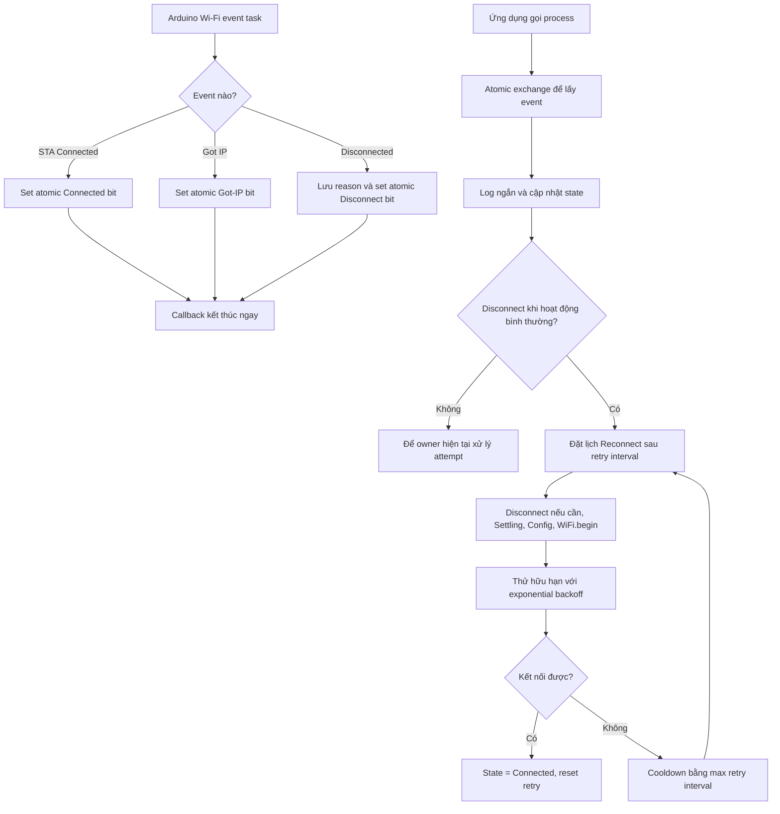

Arduino-ESP32 Auto Reconnect được tắt khi event handler của thư viện được cài.
Nhờ đó chỉ có state machine này gọi `WiFi.begin()` và hủy attempt. Lỗi mất AP là
tạm thời nên sau cooldown thiết bị vẫn có thể phục hồi. Với credential đã lưu,
`AUTH_FAIL` và handshake timeout cũng tiếp tục theo cooldown vì các reason này
có thể xuất hiện do packet loss, AP quá tải hoặc router restart. Nếu password
thực sự đã đổi, cooldown giới hạn tần suất thử và tránh reconnect storm. Callback
không gọi Serial, DNS, WebServer, Preferences hoặc API Wi-Fi blocking.
`setConnectTimeout(0)` và `connectSaved(0)` được chuẩn hóa thành 15000 ms, nên
blocking connect, Portal candidate và Auto Reconnect không thể giữ một attempt
vô hạn.

## Timeout, stop và restart Portal

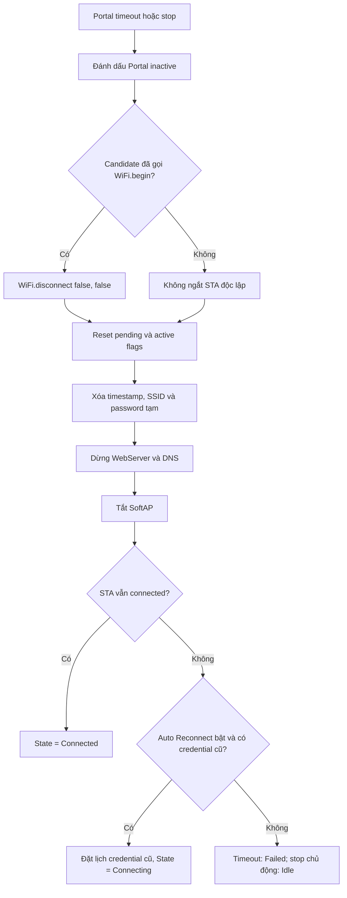

Trong blocking mode, vòng lặp kết thúc ngay khi `_portalActive` thành `false`.
Trong non-blocking mode, ứng dụng phải gọi `process()` thường xuyên. Vì cả hai
đều dùng cùng state machine, hành vi timeout và cleanup là nhất quán, không còn
STA candidate tiếp tục chạy nền. Nếu credential cũ hợp lệ còn trong cache/NVS,
`process()` phục hồi nó bằng Auto Reconnect non-blocking và không tự mở lại Portal.
Khi restart Portal, lịch phục hồi tạm thời được hủy trước khi phiên Portal mới bắt
đầu nên không có hai owner gọi `WiFi.begin()`.

## Quản lý credential chủ động

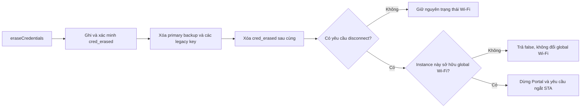

`eraseCredentials()` là thao tác xóa duy nhất do API công khai yêu cầu. Connect
Nếu reset xảy ra sau khi marker được commit, boot tiếp tục xóa thay vì phục hồi
backup còn sót. Connect timeout, Portal timeout và `stopConfigPortal()` không
xóa credential đã lưu.

---

## Async Wi-Fi scan

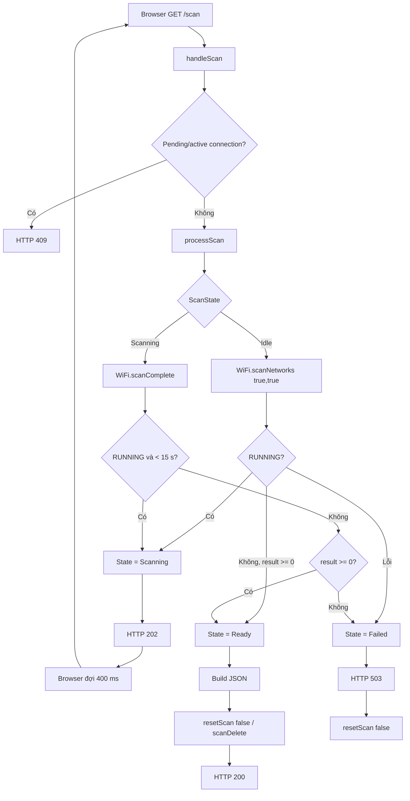

Trong khoảng thời gian browser đang đợi 400 ms, `process()` vẫn có thể gọi `processScan()` và chuyển `Scanning -> Ready/Failed`. Vì vậy không nên mô tả rằng chỉ `/scan` mới làm scan tiến triển.

## Function `process()` cooperative non-blocking — luồng rút gọn chính xác

`process()` **không chờ** Wi-Fi connection, settle delay, retry delay hoặc network scan. Tuy nhiên một lần gọi `process()` có thể phục vụ nhiều tác vụ đã sẵn sàng (event, scan, DNS, HTTP) trước khi trả về; không phải mỗi lần gọi chỉ thực hiện đúng một thao tác.

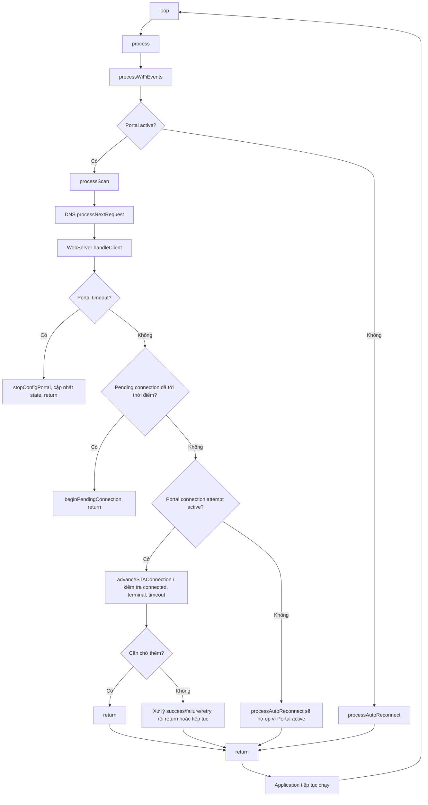

Ví dụ phase kết nối Portal candidate:

```text
process #1
  -> pending delay 350 ms đã hết
  -> beginSTAConnection()
  -> nếu STA chưa ở trạng thái clean: WiFi.disconnect()
  -> Phase = Settling, settle delay = 20 ms
  -> return

process #2 ... #N
  -> advanceSTAConnection()
  -> nếu settle delay chưa hết: return nhanh

process tiếp theo khi settle đã hết
  -> applySTAConfig()
  -> WiFi.begin()
  -> Phase = Connecting
  -> return sau các kiểm tra tức thời

các process sau
  -> đọc event / WiFi.status()
  -> kiểm tra terminal failure hoặc connect timeout bằng millis()
  -> không busy-wait
```

Nếu STA đã ở trạng thái disconnected/clean, `_connectionSettleDelayMs` có thể bằng `0`; do đó **không phải mọi attempt đều bắt buộc chờ 20 ms**.

Lưu ý: `process()` là cooperative non-blocking, nhưng các API `connectSaved()` và `startConfigPortal()` vẫn là API blocking theo thiết kế. `startConfigPortal()` đạt hành vi blocking bằng cách tự lặp `process()` bên trong.

## Luồng hoạt động tổng thể

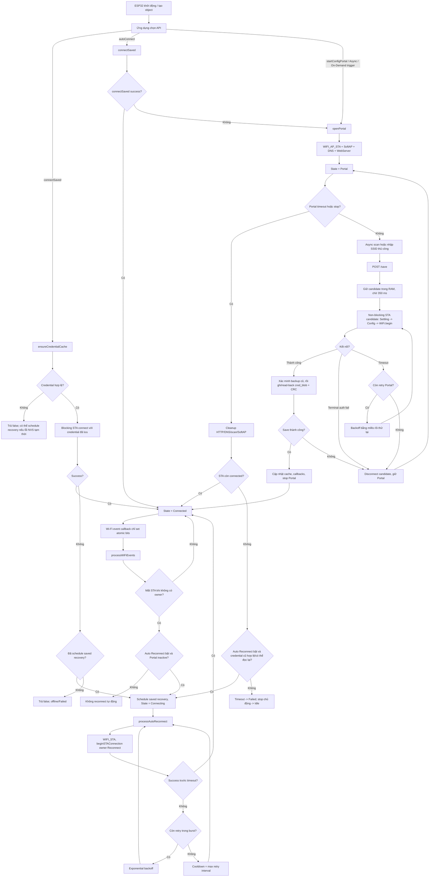

### Các điểm cần hiểu đúng

- Constructor **không tự động** đọc NVS, kết nối STA hoặc mở Portal; mọi luồng bắt đầu từ API mà ứng dụng gọi.
- Chỉ `autoConnect()` tự chuyển từ `connectSaved()` thất bại sang **blocking Config Portal**. `connectSaved()` đơn lẻ không tự mở Portal; ví dụ On-Demand có thể giữ thiết bị offline cho tới khi người dùng kích hoạt Portal.
- Config Portal không bắt buộc phải chọn SSID từ kết quả scan: Advanced Wi-Fi Setting có thể gửi hidden/unlisted SSID qua cùng `POST /save`.
- Candidate credential chỉ được ghi vào NVS sau khi STA đã kết nối. Nếu lưu/read-back/CRC thất bại, candidate bị ngắt và Portal vẫn được giữ.
- Khi Portal timeout/stop trong lúc STA offline, thư viện chỉ phục hồi Wi-Fi cũ khi Auto Reconnect bật và credential cũ còn hợp lệ hoặc có thể đọc lại. Nếu không, timeout kết thúc ở `Failed`, còn stop chủ động kết thúc ở `Idle`.
- Auto Reconnect chạy trong `process()` và dùng retry hữu hạn + exponential backoff + cooldown; Arduino core Auto Reconnect được tắt để tránh hai luồng reconnect cạnh tranh.
