# ESP32WiFiPortal 2.1.2 Operational Flowcharts

This document describes the state machine of `ESP32WiFiPortal` 2.1.2 for blocking connections, blocking/non-blocking Config Portal operation, Wi-Fi events, retries, Auto Reconnect, and asynchronous Wi-Fi scanning.

## STA Address Configuration

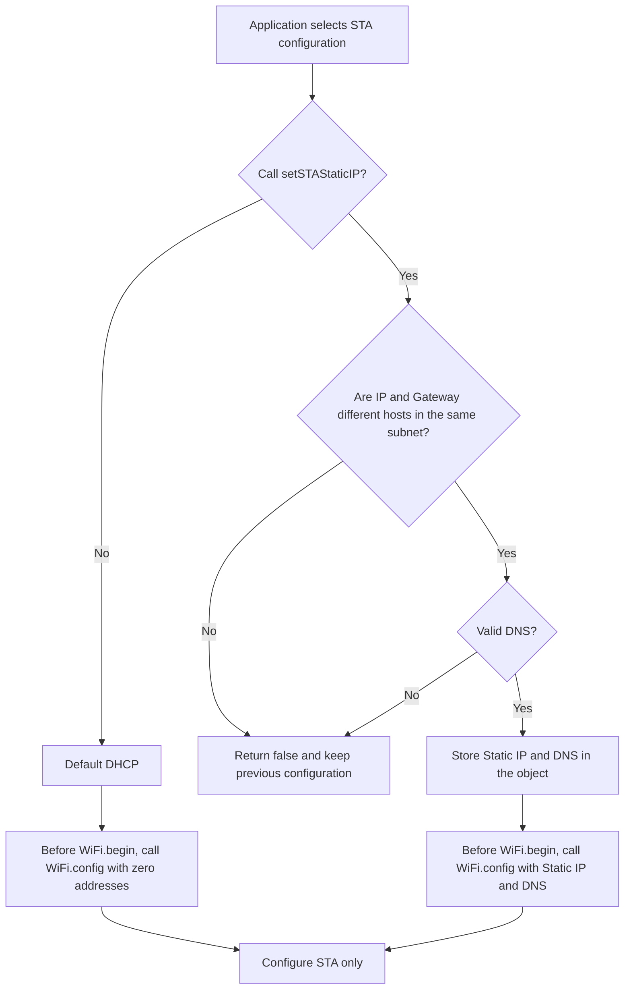

`useSTADHCP()` selects DHCP again for the next library-managed connection. The
STA configuration does not read or modify the SoftAP Portal IP.

## Startup and Connection Using Saved Credentials

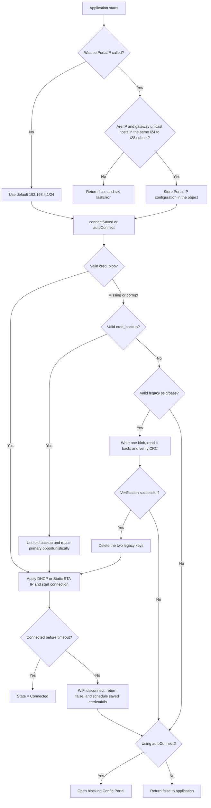

`connectSaved()` reads the `ewp_wifi` namespace; connection failure does not
delete saved credentials. A corrupted record is rejected and is not used by
Auto Reconnect; a temporary NVS-open failure is retried after cooldown. If a
Portal is active, the library stops and cleans up the Portal before switching
to `WIFI_STA`. When Auto Reconnect is enabled, a failed blocking attempt still
schedules a non-blocking retry; `autoConnect()` cancels that schedule when it
immediately switches to the Portal, so there are no two connection owners.

## Config Portal Initialization

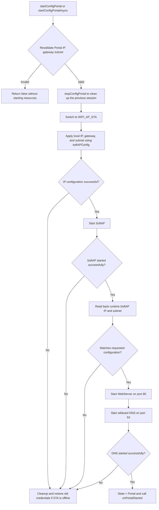

The Portal IP remains fixed throughout the active session. `setPortalIP()`
returns `false` if it is called while the Portal is active, ensuring that
SoftAP, DNS, and HTTP redirects always use the same address.

The validator accepts valid unicast Class A/B/C addresses but uses CIDR `/24`
through `/28` for SoftAP DHCP; it does not infer classful `/8` or `/16` masks.
RFC 1918 addresses are still recommended to avoid routing conflicts.
`200.5.29.8/24` is supported for the local SoftAP, but it does not replace the
safe default `192.168.4.1/24`.

The validator also calculates the default lease pool used by Arduino-ESP32
3.3.11 in advance and rejects an IP/gateway inside that pool. This prevents a
case where the setter succeeds but `softAPConfig()` would inevitably fail at
startup.

Pure IPv4 validation checks are packaged as `private static inline` helpers
directly inside the `ESP32WiFiPortal` class. Therefore, the library has only
one implementation, does not expand the public API, allocates no heap memory
during validation, and does not cause multiple-definition errors when multiple
translation units include the main header.

## Non-Blocking Wi-Fi Scan in the Portal

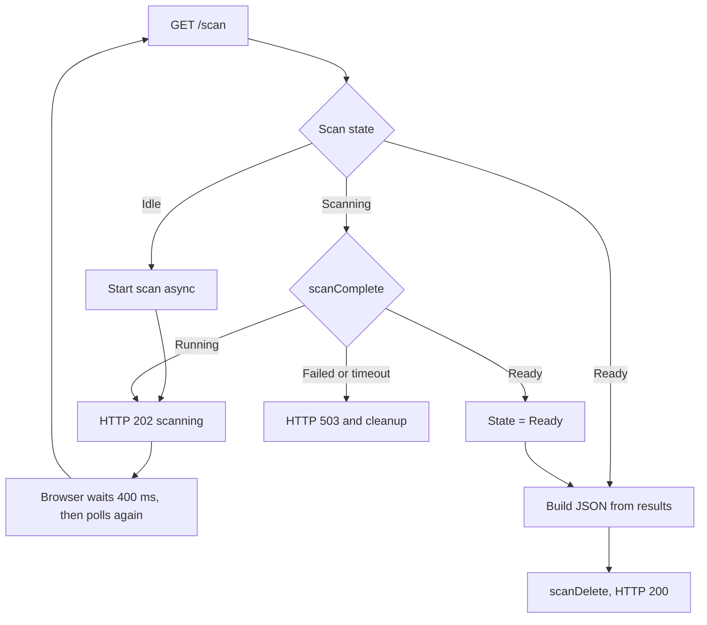

The scan driver runs asynchronously, so each `process()` call only polls the
state and then continues serving DNS, HTTP, and the state machine. Stopping the
Portal or receiving a valid connection request cancels any running scan and
releases its results; two scans never run concurrently.

## Receiving and Testing New Credentials

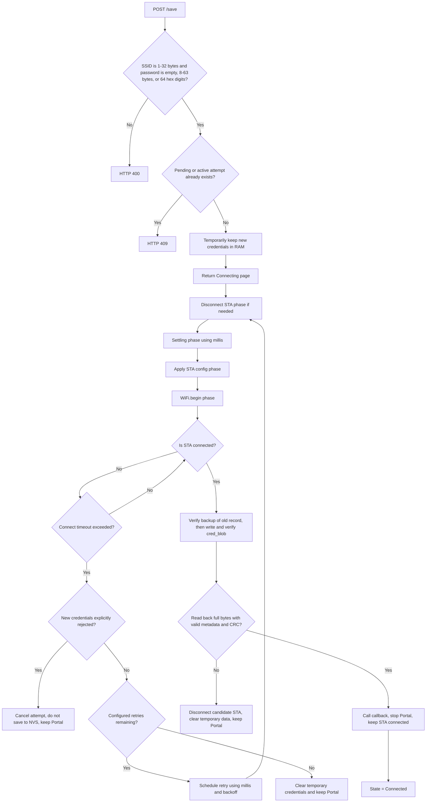

The old credentials in NVS are not modified when the candidate cannot connect
or when the Portal times out. Writing occurs only after `WL_CONNECTED`. A
handshake timeout does not automatically prove that the password is incorrect,
because weak signal conditions or an AP restart may also cause it.

SSIDs from both the scan list and **Advanced Wi-Fi Setting** are preserved byte
for byte without calling `trim()`. The Advanced view uses the same POST `/save`,
the same candidate RAM storage, and the same state machine; the password is not
placed in the URL or browser storage.

## Wi-Fi Events and Auto Reconnect

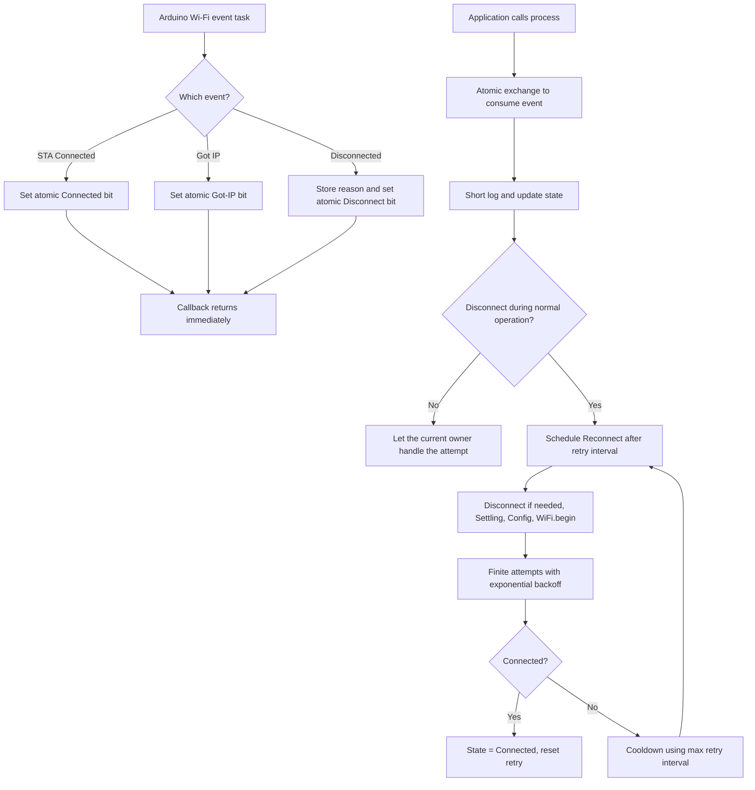

Arduino-ESP32 Auto Reconnect is disabled when the library's event handler is
installed. Therefore, only this state machine calls `WiFi.begin()` and cancels
attempts. Loss of the AP is treated as temporary, so the device can still
recover after cooldown. With saved credentials, `AUTH_FAIL` and handshake
timeouts also continue through cooldown because these reasons can occur due to
packet loss, AP overload, or router restart. If the password has actually
changed, the cooldown limits the retry frequency and prevents a reconnect
storm. The callback does not call Serial, DNS, WebServer, Preferences, or any
blocking Wi-Fi API. `setConnectTimeout(0)` and `connectSaved(0)` are normalized
to 15000 ms, so blocking connect, Portal candidate, and Auto Reconnect cannot
hold an attempt indefinitely.

## Portal Timeout, Stop, and Restart

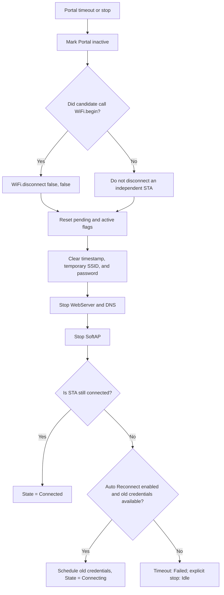

In blocking mode, the loop ends immediately when `_portalActive` becomes
`false`. In non-blocking mode, the application must call `process()`
frequently. Because both modes use the same state machine, timeout and cleanup
behavior is consistent, and no candidate STA continues running in the
background. If valid old credentials are still available in cache/NVS,
`process()` restores them using non-blocking Auto Reconnect without reopening
the Portal automatically. When the Portal restarts, the pending recovery
schedule is canceled before the new Portal session starts, so two owners never
call `WiFi.begin()` concurrently.

## Explicit Credential Management

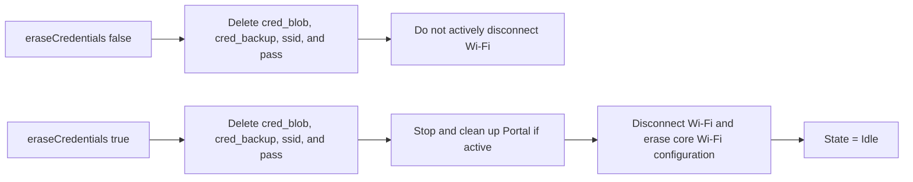

`eraseCredentials()` is the only deletion operation explicitly requested by
the public API. Connect timeout, Portal timeout, and `stopConfigPortal()` do not
delete saved credentials.

---

## Async Wi-Fi Scan

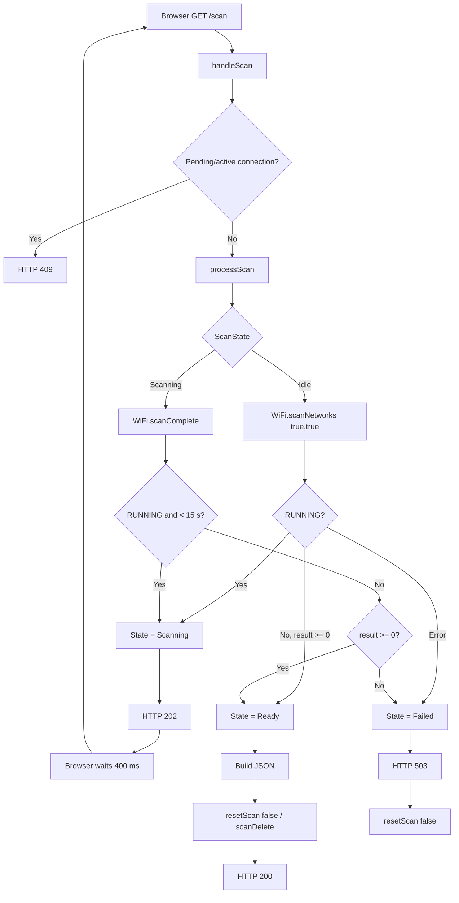

While the browser is waiting for 400 ms, `process()` can still call
`processScan()` and transition `Scanning -> Ready/Failed`. Therefore, it should
not be described as if only `/scan` can advance the scan.

## Cooperative Non-Blocking `process()` Function — Accurate Simplified Flow

`process()` **does not wait** for a Wi-Fi connection, settle delay, retry delay,
or network scan. However, a single `process()` call may service multiple tasks
that are already ready (event, scan, DNS, HTTP) before returning; it is not
limited to performing exactly one operation per call.

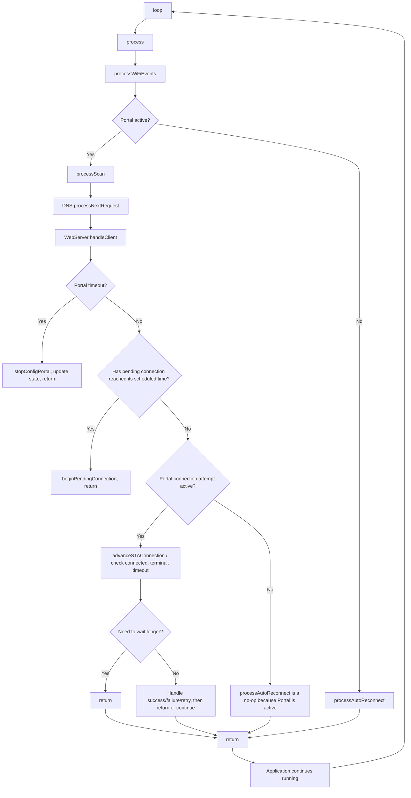

Example of a Portal candidate connection phase:

```text
process #1
  -> pending delay of 350 ms has elapsed
  -> beginSTAConnection()
  -> if STA is not in a clean state: WiFi.disconnect()
  -> Phase = Settling, settle delay = 20 ms
  -> return

process #2 ... #N
  -> advanceSTAConnection()
  -> if settle delay has not elapsed: return quickly

next process after settle delay has elapsed
  -> applySTAConfig()
  -> WiFi.begin()
  -> Phase = Connecting
  -> return after immediate checks

subsequent process calls
  -> read event / WiFi.status()
  -> check terminal failure or connect timeout using millis()
  -> no busy-wait
```

If STA is already in a disconnected/clean state, `_connectionSettleDelayMs` may
be `0`; therefore, **not every attempt is required to wait 20 ms**.

Note: `process()` is cooperative non-blocking, but the `connectSaved()` and
`startConfigPortal()` APIs are still blocking APIs by design.
`startConfigPortal()` achieves blocking behavior by repeatedly calling
`process()` internally.

## Overall Operational Flow

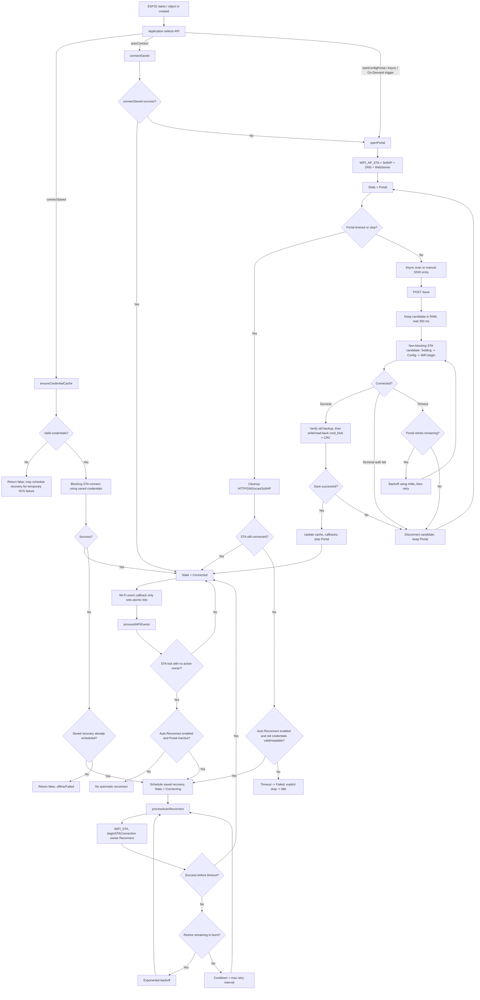

### Key Points to Understand Correctly

- The constructor **does not automatically** read NVS, connect STA, or open the Portal; every flow starts from an API called by the application.
- Only `autoConnect()` automatically transitions from a failed `connectSaved()` attempt to a **blocking Config Portal**. Calling `connectSaved()` alone does not open the Portal automatically; for example, an On-Demand setup can keep the device offline until the user explicitly activates the Portal.
- The Config Portal does not require selecting an SSID from scan results: Advanced Wi-Fi Setting can submit a hidden/unlisted SSID through the same `POST /save` endpoint.
- Candidate credentials are written to NVS only after STA has connected. If save/read-back/CRC verification fails, the candidate is disconnected and the Portal remains active.
- When the Portal times out/stops while STA is offline, the library restores the old Wi-Fi connection only if Auto Reconnect is enabled and the old credentials are still valid or can be read again. Otherwise, a timeout ends in `Failed`, while an explicit stop ends in `Idle`.
- Auto Reconnect runs inside `process()` and uses finite retries + exponential backoff + cooldown; Arduino core Auto Reconnect is disabled to prevent two competing reconnect flows.
